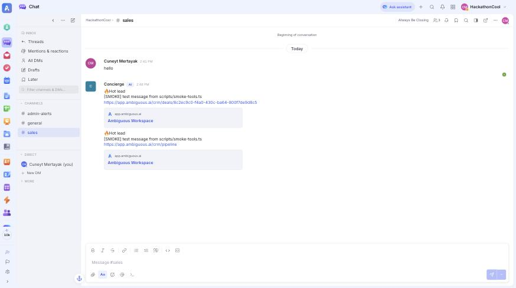

# Concierge — build log

Stage-by-stage record of the build in [`dev-plan.md`](dev-plan.md). Each stage ends with checks anyone can rerun. After each stage the build stops; the next one starts only when Cuneyt or Oskar confirms.

**What each stage should look like:** [`stage-screens.md`](stage-screens.md) (ASCII sketches).

**How to follow along:** `git log --oneline` shows one commit per stage (`build(sN): …`). Each stage below lists the files changed, how to check it, and what we saw.

## Stages

| Stage | Dev-plan milestone | Goal | Status |
|---|---|---|---|
| S1 | M0 P1 | Next.js + CopilotKit runtime + chat popup answers "hi" | done (68c8b7c) |
| S2 | M0 both | `lib/contracts.ts`: tool result types + fixture data | review (Oskar) |
| S3 | M0 P2 | Seed Ambiguous: demo company Wiki pages, sales channel (writes to the real workspace) | in progress (Oskar: Wiki; Cuneyt: #sales) |
| S4 | M1 P1 | Ambiguous client + `search_knowledge`, `create_lead`, `notify_team` + smoke script | review (write test waits for S3 + go) |
| S5 | M1 P2 | Acme website sections + `SourceCard`, `LeadCard` → checkpoint: Flow A without booking | todo |
| S6 | M2 | Booking: `get_slots`, `choose_slot` (SlotPicker), `book_meeting` (BookedCard) | todo |
| S7 | M2 | Flow E: `capture_email` (EmailCapture), `log_gap` (GapCard) | todo |
| S8 | M2 | Flow B playbook via `useAgentContext` + X1 `highlight_plan` → feature freeze | todo |
| S9 | M3 | `scripts/reset-demo.ts` + split-screen setup | todo |
| S10 | M4 | Rehearse twice, backup video | todo |

---

## S1 — scaffold + chat reply

**Goal:** the Next.js app runs on `localhost:3000`, the CopilotKit runtime lists the `default` agent, and the popup streams a Claude reply to "hi".

**Files**

| File | What |
|---|---|
| `package.json`, `package-lock.json` | Next.js 16.3.5, React 19.2.8, Tailwind 4, `@copilotkit/react-core@1.71.1`, `@copilotkit/runtime@1.71.1`, `zod@3` |
| `tsconfig.json`, `next.config.ts`, `eslint.config.mjs`, `postcss.config.mjs`, `public/` | `create-next-app` defaults (scaffolded in a temp folder, moved in) |
| `AGENTS.md`, `CLAUDE.md` | Written by `create-next-app`: tells coding agents to read `node_modules/next/dist/docs/` because Next 16 differs from their training data |
| `.gitignore` | Merged ours with Next's; also ignores `.idea/` |
| `app/api/copilotkit/[[...slug]]/route.ts` | Copilot Runtime with one agent named `default` |
| `lib/agent.ts` | `BuiltInAgent`, `maxSteps: 8`, placeholder prompt. Model from `CONCIERGE_MODEL`, default `anthropic:claude-sonnet-5` |
| `app/layout.tsx` | `CopilotKitProvider` + CopilotKit v2 styles |
| `app/page.tsx` | Placeholder page (real Acme site in S5) |
| `components/concierge/ConciergeWidget.tsx` | `CopilotPopup` |

**Check it**

```bash
npm install                                   # ~16 min on first run (1,592 packages)
npm run dev                                   # port 3000; if taken: npx next dev -p 3100
curl -s localhost:3000/api/copilotkit/info    # lists "default"
npx tsc --noEmit && npm run lint              # both clean
# open http://localhost:3000, click the chat bubble, type "hi"
```

**Result (2026-09-12, Cuneyt's machine, port 3100 because another app holds 3000)**

| Check | Seen |
|---|---|
| `GET /api/copilotkit/info` | `200`, `"agents":{"default":{"className":"BuiltInAgent", …}}`, version `1.71.1` |
| Chat "hi" | `POST /api/copilotkit/agent/default/run 200 in 1559ms`; reply "Hi there! Welcome to Acme — how can I help you today?" |
| Model | `anthropic:claude-sonnet-5` accepted by the bundled `@ai-sdk/anthropic`; no fallback needed |
| `tsc --noEmit`, `eslint` | Clean |


**Notes for later stages**

- The dev log prints an AI SDK warning about system messages in `messages`. It comes from CopilotKit's `BuiltInAgent` and is harmless.
- CopilotKit runtime telemetry is on by default. To turn it off, add `COPILOTKIT_TELEMETRY_DISABLED=true` to `.env.local`.
- Use `localhost`, not `127.0.0.1`: Next 16 blocks dev resources (HMR) from other origins unless they're listed in `allowedDevOrigins`.
- The `BuiltInAgent` instance lives at module scope, so it handles one run at a time. That's fine for a single-visitor demo (`copilotkit-context.md` gotcha 3).

---

## S2 — tool contracts

**Goal:** one file both tracks build against. Track A implements tools that return these shapes; Track B builds cards from `FIXTURES` without waiting for Ambiguous.

**Files**

| File | What |
|---|---|
| `lib/contracts.ts` | `TOOL` names, Zod parameter schemas (used by server tools and browser hooks alike), result types, `FIXTURES` |
| `docs/concierge/dev-plan.md` | Contract table synced; now points to `lib/contracts.ts` as source of truth |

**Changes vs. the dev-plan table** (driven by the sketches in `stage-screens.md` and the Ambiguous API spec)

| Tool | Change | Why |
|---|---|---|
| `search_knowledge` | Result hit gets optional `content` | Wiki search returns a ~65-character `snippet`: too short to answer from. The tool will also fetch page text for the model; cards ignore it |
| `create_lead` | Result gets `need` | LeadCard shows "needs SAP" |
| `book_meeting` | Params: `contactName` and `email` now required | `POST /api/public/scheduler/…/book` requires `guest_name` and `guest_email` |
| `log_gap` | Result gets `question`, `email?` | GapCard shows the question and where the answer goes |

**Findings from the Ambiguous API (read-only, Concierge key)**

| Endpoint | Finding |
|---|---|
| `GET /api/wiki/search?q=` | `200`; hits have `id`, `title`, `slug`, `snippet`, `space_id` |
| `GET /api/channels` | Only `general` (public) and Concierge's DM. **No `#sales` yet** |
| `GET /api/crm/deals` | `0` deals |
| `GET /api/crm/scheduler-links` | `0` links. `POST` exists (title, duration, `member_user_ids`, `auto_create_contact`), and public `…/slots?date=` + `…/book` exist → **S6 can book for real**; no need for the Task fallback unless it fails in testing |

**Check it**

```bash
npx tsc --noEmit && npm run lint   # clean
```

**Result:** `tsc` and `eslint` clean. Awaiting Oskar's review of names and shapes before S5 builds on them.

---

## S4 — server tools + smoke script

**Goal:** the agent can read the Wiki and write to the CRM and Chat. Each tool is testable from a terminal, without the chat.

**Files**

| File | What |
|---|---|
| `lib/ambiguous.ts` | `ambi()` fetch helper: Bearer `AMBI_API_TOKEN`, `API-Version: 1`, retries 429 honoring `Retry-After`, errors include status + first 300 chars. `docToText()` flattens Wiki editor JSON to text |
| `lib/tools/search-knowledge.ts` | `GET /api/wiki/search?q=&space=acme&limit=3`; if 0 hits, retries word by word; fetches each page (`GET /api/wiki/pages/{id}`) for `content` (≤2,000 chars). Link: `…/wiki/{space}/{page-slug}` |
| `lib/tools/create-lead.ts` | `POST /api/crm/contacts` (company), `POST /api/crm/contacts` (person, linked), `POST /api/crm/deals` (open, linked, pipeline **Sales** / first stage; 409 → reuse existing deal). Deal title: `Northline Freight: 200 seats, live by Q4, SAP integration` |
| `lib/tools/notify-team.ts` | Finds the `sales` channel via `GET /api/channels`, posts `🔥 Hot lead` + summary + deal link |
| `lib/agent.ts` | Prompt: knowledge + qualifying rules; registers the 3 tools |
| `scripts/smoke-tools.ts`, `package.json` (`npm run smoke`, `tsx`) | Read-only by default; `--write` also runs `create_lead` + `notify_team` with `[SMOKE]` names |

**Settings (optional, `.env.local`)**

| Variable | Default | Use |
|---|---|---|
| `CONCIERGE_WIKI_SPACE` | `acme` | The only Wiki space visitors can see. Internal pages (playbook) stay in `home` |
| `CONCIERGE_SALES_CHANNEL` | `sales` | Channel for hot-lead alerts |
| `CONCIERGE_PIPELINE` | `Sales` | CRM pipeline for new deals (first stage) |
| `CONCIERGE_COMPANY` | `Acme` | Company name in the prompt |

**Check it**

```bash
npm run smoke              # read-only
npm run smoke -- --write   # creates [SMOKE] company, contact, deal + one #sales message
```

**Result so far (2026-09-12)**

| Check | Seen |
|---|---|
| `npm run smoke` (read-only) | `search_knowledge "SAP"` **FAIL: 0 results**, expected: the `Acme` space doesn't exist yet (S3). `"on-prem"` ok, 0 results |
| Search against `home` space, query "how AI coworkers work" | Phrase search 0 → word fallback → 3 pages with text content; link `https://app.ambiguous.ai/wiki/home/welcome` matches the browser URL |
| Chat runtime, "Do you integrate with SAP?" (`POST /api/copilotkit/agent/default/run`) | `TOOL_CALL_START search_knowledge {"query":"SAP integration"}` → `{"results":[]}` → reply: "I don't have that info handy, so I'll check with the team and follow up. In the meantime, are you exploring Acme for your company?" |
| `tsc --noEmit`, `eslint` | Clean |

**Write test (2026-09-12, after Cuneyt created `#sales`)**

| Check | Seen |
|---|---|
| `npm run smoke -- --write`, 1st run | `create_lead ok`, `notify_team ok`, but the deal was **invisible on the CRM board** ("No pipelines configured") and Concierge's key got `404` reading its own deal |
| Fix: pipeline | Created CRM pipeline **Sales** (API, Concierge key): New lead → Meeting booked → Proposal → Won / Lost. `PATCH` of `pipeline_id` on an existing deal is silently ignored, so `create_lead` now sets `pipeline_id` + first `stage_id` at creation |
| Fix: reruns | Ambiguous answers `409 {"error":"Deal already exists","deal_id":…}` for a duplicate title; `create_lead` now reuses that `deal_id` |
| Cleanup | Deleted all test CRM records (1 deal outside any pipeline, 3 `[SMOKE]` companies, 3 "Jane Doe" contacts) with Cuneyt's owner session: `204` each, CRM back to 0/0 |
| `npm run smoke -- --write`, final run | `create_lead ok` → deal in **Sales / New lead** on the board; `notify_team ok` → "🔥 Hot lead" message from Concierge (AI) in `#sales` |
| Deal link | `/crm/deals/{id}` opens the CRM overview; the app's real link is **`/crm/pipeline?deal={id}`** (now used) |




**Left in the workspace on purpose:** 1 `[SMOKE]` company, contact and deal (Sales / New lead) and 2 `[SMOKE]` messages in `#sales`. S9's reset removes them.

**Still open before S4 is done:** `search_knowledge "SAP"` needs Oskar's `Acme` space (S3) → `npm run smoke` all green.

**Notes**

- Web app routes seen: `/wiki/{space-slug}/{page-slug}`, `/crm/pipeline?deal={id}`, `/chat/{channel-id}`, `/tasks`.
- **Concierge can create deals but can't read them** (`GET /api/crm/deals` → 0, `GET /api/crm/deals/{id}` → 404, while the owner sees them, `owner_id` = Concierge). S6's "move deal to Meeting booked" may need another route; test it there.
- The workspace (`HackathonCool`) shows `0 / 10,000 actions used · Trial`, not the Free plan's 1,000 from `ambiguous-context.md`.
- **Env gotcha (hit on Cuneyt's terminal):** an empty variable already in the shell beats `.env.local`, both for `tsx --env-file` and for Next.js. oh-my-zsh's dotenv plugin sources `.env` on `cd`, and a `.env` copied from `.env.example` exports `AMBI_API_TOKEN=` and `ANTHROPIC_API_KEY=` empty. Symptom: `AMBI_API_TOKEN is empty`. Fix: keep secrets only in `.env.local`, no `.env`; in an open terminal run `unset AMBI_API_TOKEN ANTHROPIC_API_KEY AMBI_API_URL`.
- Chat-created records carry no prefix (the audience sees them). S9's reset must find them another way (e.g. created by the Concierge agent), not by a `[DEMO]` title prefix.
