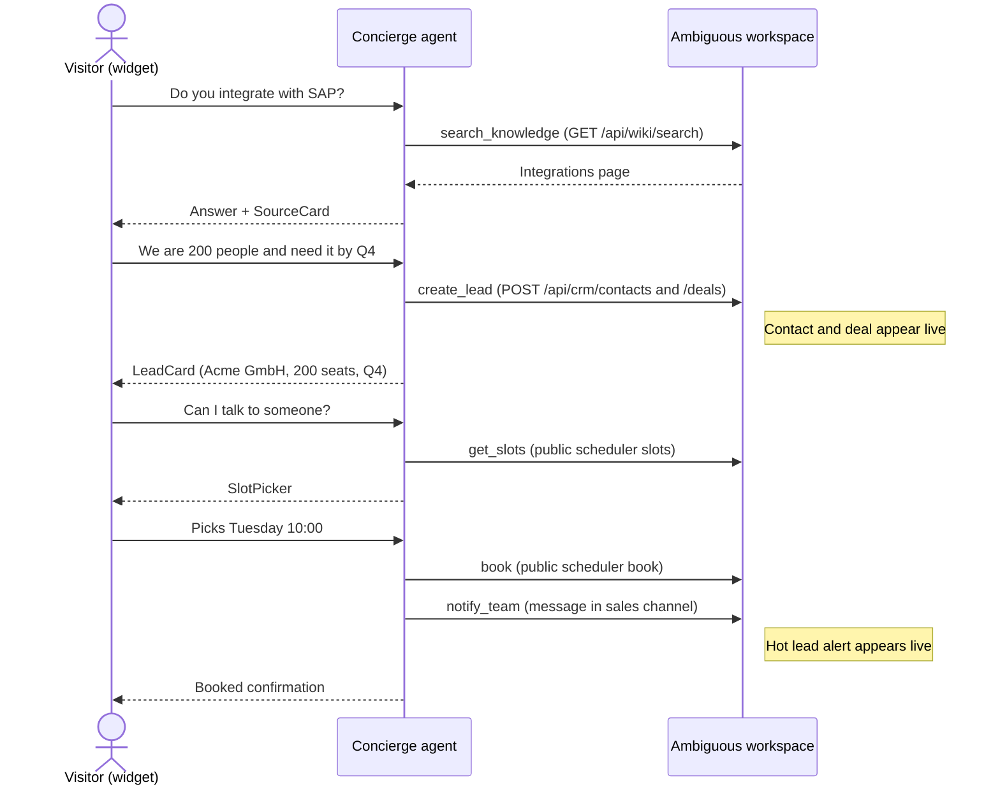
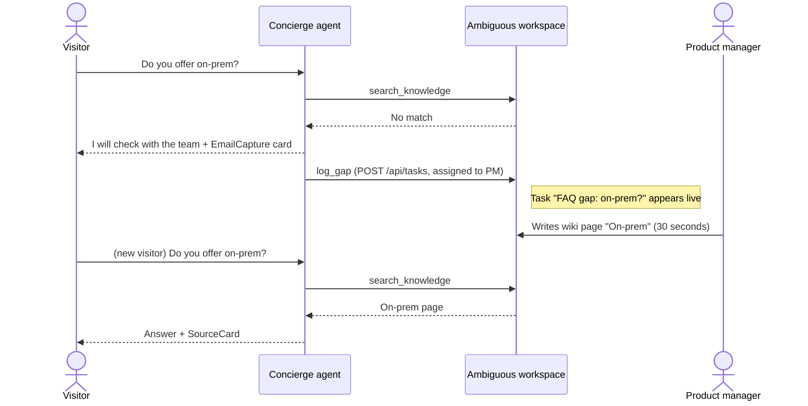
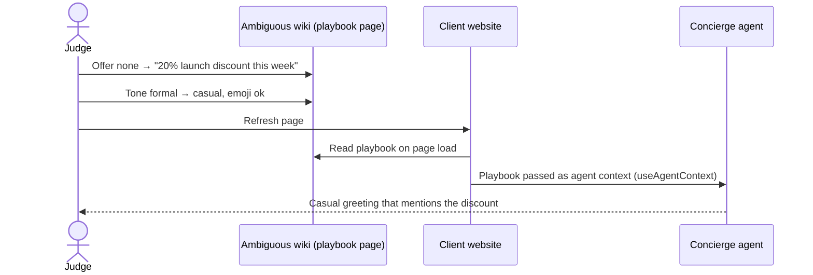

# Concierge — hackathon demo plan

What we build in ~3 hours, what we show, and what we cut. Companion to [`concierge-design.md`](concierge-design.md) (the full product design).

## TL;DR

- The **full design does not fit in 3 hours**. A scoped demo does: **3 flows (A, E, B), one company, one workspace**, two people in parallel.
- **Wow factor = split screen.** Left: a fake client website with the Concierge widget. Right: the Ambiguous workspace. Every visitor message causes a visible change on the right (CRM deal, sales alert, task, wiki page).
- **Feature freeze at 2:10.** Last 30 minutes are rehearsal and a backup video.

## The flows

| Flow | Story | Wow | Build time | Status |
|---|---|---|---|---|
| **A** | Visitor → qualified lead → booked meeting | CRM deal + meeting + sales alert in ~90 s, no human | ~80 min | **Core** |
| **E** | Agent detects a knowledge gap → PM fills it live | Company knowledge improves during the demo | ~15 min | **Core** |
| **B** | Judge edits the playbook wiki page → agent changes | Judge participation; "adapts per client" without code | ~15 min | **Core** |
| C | Logged-in customer asks about an order | Shows the B2C use case | +35 min | Stretch |
| D | Sales rep replies in Ambiguous Chat → reply appears in widget | Human takeover | +50 min | Stretch, risky |

### Flow A — visitor to booked meeting

**Tools:** `search_knowledge`, `create_lead`, `get_slots`, `book`, `notify_team`
**Generative UI:** SourceCard, LeadCard, SlotPicker
**Risk:** the public scheduler endpoints are untested. Fallback below.

### Flow E — the agent finds what the company doesn't know

**Extra work over Flow A:** one tool (`log_gap`) and one card. Search is already built.

### Flow B — the company reprograms the agent without code

**How:** the page reads the playbook wiki page on load and hands it to the agent with `useAgentContext`. No multi-tenancy needed.

### Flow C — order status (stretch)

A hardcoded "logged-in" demo customer asks "Where is my order?" → agent reads an orders Sheet → **OrderCard** (status, tracking) → "Change my address" → confirmation card (`useHumanInTheLoop`) → Task for the ops team.

### Flow D — human takeover (stretch, risky)

Sales rep replies in Ambiguous Chat → reply shows up in the widget. Needs a webhook reachable from the internet (tunnel) or polling. Only attempt if everything else is done early.

## 3-minute demo script

| Time | Flow | What the audience sees |
|---|---|---|
| 0:00–1:15 | A | Visitor asks, gets a sourced answer, becomes a CRM deal, books a meeting; sales alert pops up on the right |
| 1:15–2:15 | E | Agent can't answer, creates a task; PM writes the wiki page; next visitor gets the answer |
| 2:15–2:45 | B | A judge edits the playbook; refresh; agent's tone and offer change |
| 2:45–3:00 | Close | "Every Ambiguous client gets a website agent that works on its own workspace data. Routine calls cost them zero AI actions." |

The closing claim comes from Ambiguous pricing: external agents' routine CRUD does not consume AI actions. Drop it if the demo uses premium operations (image generation, web search).

## Is it doable in 3 hours?

| Piece | Estimate | Risk |
|---|---|---|
| Setup: Ambiguous workspace + API key, CopilotKit v2 Next.js app with Claude | 25 min | Medium (first time on v2) |
| Seed data: wiki pages, playbook page, CRM, sales channel (via Ambiguous CLI) | 20 min | Low |
| Flow A without booking: 3 tools + SourceCard + LeadCard | 50 min | Medium |
| Booking: SlotPicker + scheduler endpoints | 30 min | **High** (endpoint untested) |
| Flow E | 15 min | Low |
| Flow B | 15 min | Low |
| Fake client website page | 20 min | Low |
| Rehearsal + backup video | 30 min | Mandatory |
| **Total (two people in parallel)** | **≈ 2 h 50 min** | Tight but doable |
| Flow C / Flow D | +35 min / +50 min | Does not fit |

## What we cut from the full design

| Cut | Demo replacement | Time saved |
|---|---|---|
| `<script>` widget embedded on real client sites, CORS | Next.js page styled as the client's website, with `CopilotPopup` | ~50 min |
| Multi-tenant, per-client API keys, provisioning | One workspace, `ak_` key in `.env` | ~40 min |
| Visitor verification tiers | Anonymous-visitor flows only | ~30 min |
| One agent instance per request | Single agent instance (one demo visitor at a time) | ~15 min |
| Webhooks and two-way human handoff | One-way message to the sales channel | ~50 min |

## Who does what

```mermaid
gantt
    title 3-hour plan
    dateFormat HH:mm
    axisFormat %H:%M
    section Person 1 (agent + Ambiguous)
    Workspace + key + CopilotKit runtime       :p1a, 00:00, 30m
    Tools search_knowledge + create_lead + notify_team :p1b, after p1a, 50m
    Scheduler check (fallback ready) + log_gap :p1c, after p1b, 50m
    Bug fixes                                  :p1d, after p1c, 20m
    section Person 2 (UI + demo)
    Seed wiki + playbook + CRM + sales channel :p2a, 00:00, 30m
    Fake client site + SourceCard + LeadCard   :p2b, after p2a, 50m
    SlotPicker + gap card + playbook context   :p2c, after p2b, 50m
    Split-screen layout + pitch                :p2d, after p2c, 20m
    section Both
    Rehearse twice + backup video + submit     :b1, 02:30, 30m
```

| Clock | Person 1 — agent + Ambiguous | Person 2 — UI + demo |
|---|---|---|
| 0:00 | Workspace, `ak_` key, CopilotKit runtime | Seed wiki, playbook, CRM, sales channel via CLI |
| **0:30** | **Checkpoint:** chat replies; `whoami` OK | |
| 0:30 | Tools: `search_knowledge`, `create_lead`, `notify_team` | Fake client site + popup, SourceCard, LeadCard |
| **1:20** | **Checkpoint:** Flow A (without booking) works end to end | |
| 1:20 | Scheduler endpoints (20-min timebox), `log_gap` tool | SlotPicker, gap card, playbook via `useAgentContext` |
| **2:10** | **Checkpoint:** A + E + B work → **feature freeze** | |
| 2:10 | Bug fixes | Split-screen layout, pitch text |
| 2:30 | Rehearse twice, record backup video, submit | |

## Fallback rules

| Trigger | Action |
|---|---|
| Scheduler endpoint not working by **1:40** | SlotPicker shows fixed slots; booking creates a Task "Call Acme Tue 10:00". Demo looks identical. |
| CopilotKit not streaming by **0:45** | Cut Flow B and the gap card; demo Flow A only. |
| Anything broken at **2:10** | Stop building. Demo what works; use the backup video for the rest. |

## Decide before starting

1. **Demo company:** name and product for the seeded wiki (e.g. a B2B SaaS with an SAP integration and no on-prem option, so Flows A and E work).
2. **Model:** Claude via CopilotKit `BuiltInAgent` (confirm the model specifier; see design doc §8).
3. **Who is Person 1 and Person 2.**
